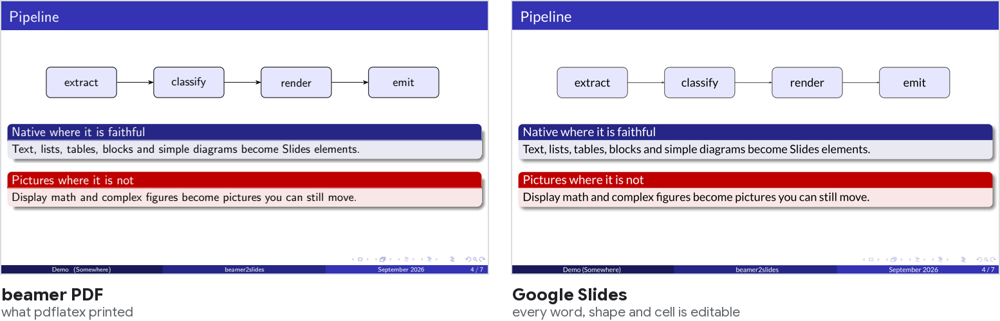
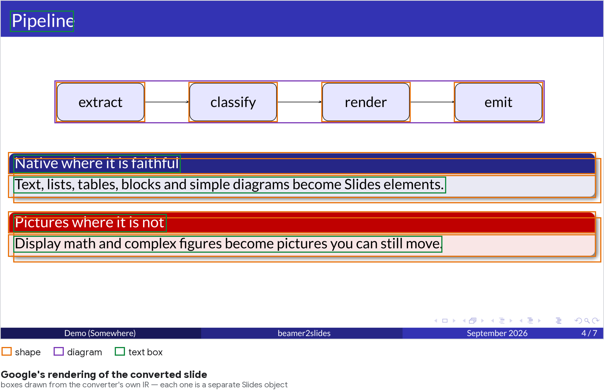
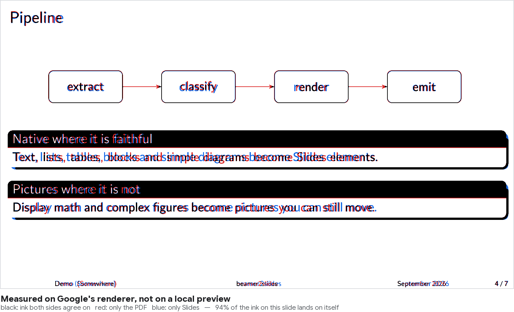
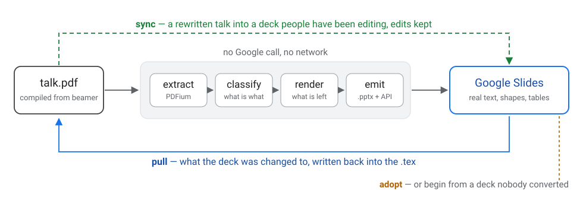
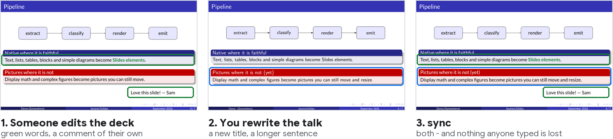
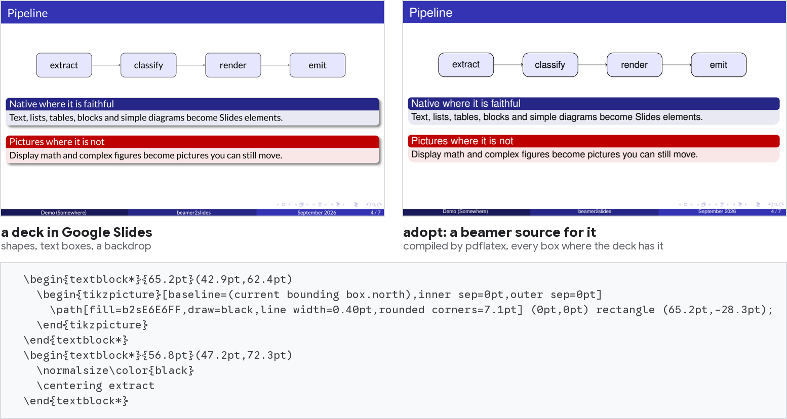
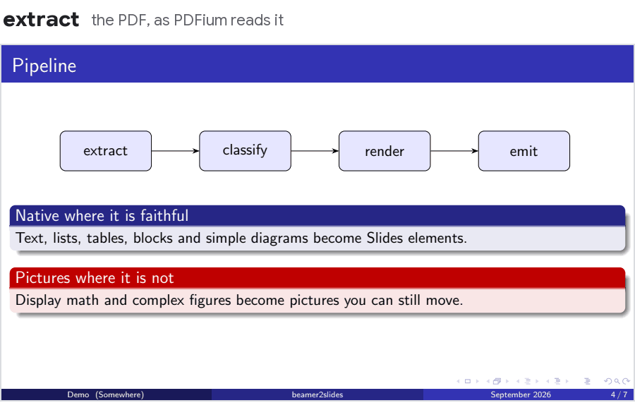

# beamer2slides

**Turn a beamer PDF into a Google Slides deck people can actually edit.** Not one picture per
slide: real text boxes, real bullet lists, real tables, real shapes — in the same places, in
matching fonts, to within a point or two.



Only what cannot be rebuilt faithfully — display math, TikZ/pgfplots figures, theme decoration —
becomes a picture, and even those stay objects you can move rather than paint on the background.

## Nothing is a screenshot

Every box below is a separate Slides object: click it, retype it, recolour it, drag it. The TikZ
pipeline became four rounded shapes with arrows between them; the beamer blocks became a title bar,
a body panel and their text.



## Fidelity is measured, not eyeballed

Every slide is exported back through `presentations.pages.getThumbnail` — Google's own renderer,
not a local preview — and compared with the PDF page on the same pixel grid, whole-slide and per
text box. A calibration deck measures the font substitutes once (width ratios, first-baseline
offsets) and feeds the correction tables.



## …and it goes both ways



| | |
|---|---|
| `convert` | the PDF becomes a deck. Re-run it and the same deck is updated in place. |
| `sync` | you rewrote the talk, other people have been editing the deck. Three-way merge; their edits win, conflicts are reported, nothing is lost — and that claim is [fuzzed against a loss oracle](docs/sync.md#proving-nothing-is-lost-fuzzing-toolsloss_oraclepy--toolsfuzz_syncpy). |
| `pull` | someone fixed a typo in Slides. Get it back into the `.tex`, as an edit a human would have made. |
| `adopt` | you have a deck nobody ever converted — one a person built in Slides. Get a beamer source for it, and take it from there. |

A real run of `sync` on the demo talk: a colleague made two words bold and green and left a note on
the slide; meanwhile the talk was rewritten. After the sync the deck has both.



And `adopt` on the same slide, read back from Google Slides as if nobody had ever converted it:
every shape, box and word gets its own place in the new source, and the source compiles back to the
slide.



## What you get
- **Text boxes** with colours, bold/italic/small caps and links. Fonts that are Google fonts in
  the PDF (Fira Sans, Source Sans, Roboto, …) keep their family and weight. Helvetica, Times,
  Courier and their TeX Gyre/Nimbus clones become the metric-compatible Arial, Times New Roman
  and Courier New. Computer Modern gets calibrated substitutes (CM Sans → Lato, CM Roman →
  PT Serif, CM Typewriter → Roboto Mono). Line breaks and positions match the PDF within a few points.
- **Bullet and numbered lists** with nesting (glyph, ball, drawn and icon bullets). Description
  lists, algorithm line numbers and custom item labels (`\item[--]`) use a hanging label with a
  tab, so the text lines up exactly.
- **Inline math** as text: `x ∈ ℝ`, `x²`, `aᵢ`, simple fractions `ᵃ⁄ᵦ`. Complex inline formulas
  (roots, sums, stacked scripts) are small pictures placed over a gap in the still-editable
  text and grouped with it.
- **Underlines and `\colorbox` highlights** as text styles.
- **Slide titles** in real title placeholders, so they show in Slides' outline and navigation;
  the title page uses the title and subtitle placeholders.
- **Blocks** grouped with their text, formulas grouped with their paragraph, and pictures with
  alt text (the text they show).
- **Tables** from ruled tabulars (booktabs, `\hline`, vertical rules, `\cline`) as native Slides
  tables, including `\multicolumn`/`\multirow` merged cells, `\rowcolor`/`\cellcolor` shading and
  simple math in cells. Tabulars without any rules become borderless tables.
- **Diagrams**: simple TikZ pictures (rectangles, rounded rectangles, circles, straight arrows,
  node and edge labels) as grouped native shapes, lines and text.
- **Pictures** for other figures, plots, raster images and display equations, each movable.
- **Shapes** for beamer blocks (coloured title bars and bodies) and plain coloured bars.
- **Theme**: header/footer text that is the same on every slide goes onto the slide layouts.
  The background shared by most slides is set on the master, so new slides get it too.
  Frame counters become small text boxes on each slide.
- **Speaker notes** from `show notes` or `show notes on second screen`.
- **Internal links**: table-of-contents entries jump to their slides.
- Overlays: for non-handout PDFs the last step of each frame is kept (`--overlays all` keeps
  every step; `sync` then keeps the same steps, so a deck made that way stays whole).

## Setup
1. Python 3.12: `pip install "beamer2slides[google]"`, or from a checkout `python -m venv .venv`
   then `.venv\Scripts\pip install -e .[google,dev]`. No TeX needed: the input is the compiled
   PDF. `[google]` is the client library that talks to Slides and Drive; without it the local
   journeys still run, and a caller with its own client injects it (`docs/install.md`).
2. A Google Cloud project with the Slides and Drive APIs enabled and an OAuth client of type
   *Desktop app*. Save its JSON as `client_secret.json` in this folder (git-ignored) or, for an
   installed beamer2slides, in `%APPDATA%\beamer2slides` / `~/.config/beamer2slides`.
   The first run opens a browser for consent and caches `token.json` beside it.

See `docs/install.md` for the credential search order, the scopes asked for, and how to hand the
library your own API clients.

## Usage
```
beamer2slides convert talk.pdf                     # or python -m beamer2slides convert talk.pdf
python -m beamer2slides classify talk.pdf          # local only: see decisions in out/talk/debug/
python -m beamer2slides fidelity talk.pdf          # compare Google's rendering with the PDF
python -m beamer2slides sync talk.pdf --deck <url> # a rewritten talk into an edited deck
python -m beamer2slides pull --deck <url> --tex main.tex --apply   # the deck's edits back
python -m beamer2slides adopt --deck <url> --tex new.tex           # a source for a foreign deck
```
Outputs go to `out/<pdf name>/`. Re-running `convert` on the same PDF updates the same
Google Slides deck — but if anyone edited that deck in Slides, convert stops and says so instead of
replacing it: either merge the new PDF into the deck with `sync` (keeping the edits), make a new
deck with `--new-deck`, or rebuild anyway with `--force-rebuild`, which keeps a `.pptx` backup in
`out/<pdf name>/backups` first (`docs/sync.md`, "Never lose deck edits";
`python tools/deck_backup.py list|export|restore` manages the backups).
Pictures and backgrounds travel inside a
.pptx that Drive imports as the deck's starting point: nothing is ever shared by public link,
so it works where link sharing is blocked. The only files the tool creates in Drive are the decks
themselves, backup copies you asked for, and a temporary staging deck per sync that it deletes
again — unless the sync was killed halfway, and then nothing deletes it for you.
`python tools/drive_usage.py` lists all three, and `--delete-staging` clears the leftovers.

In the debug images, green boxes are text, blue are pictures, purple tables and orange shapes.
Shaded text stays in the background (red math, blue figure, grey theme).

### Playground

**[Try it in your browser →](https://beamer2slides-playground-702466108736.europe-west1.run.app)**
— type a talk, watch the stages, and, if you sign in, get the deck in your own Drive.

```
python -m beamer2slides playground                 # http://127.0.0.1:7860
docker build -t beamer2slides-playground . && docker run -p 7860:7860 beamer2slides-playground
```
A web page to type a talk (or pick an example, or upload a PDF), compile it and see every stage:
what becomes native, what stays in the background, and the slide rebuilt from the IR over its
background, text editable in place. On the hosted one the deck is built in *your* Drive: the
browser asks Google for `drive.file` alone — which reaches only the files the app itself creates —
and the server uses that token for the one conversion and keeps nothing.
`docs/playground.md` has the details, including hosting it yourself.

## How it works



`extract` (PDFium via pypdfium2) → `classify` (lines, paragraphs, lists, tables, figures, shapes) →
`render` (background without converted content, picture crops) → `emit` (a .pptx with the
pictures, imported by Drive, then filled through the Google Slides API).
Fidelity is measured on Google's own renderer via slide thumbnails. See `CLAUDE.md` and
`docs/` for design notes, calibration data and pitfalls.

## Tests
```
python tests/decks/build.py          # compile test decks (needs a TeX distribution)
python tests/themes/sweep.py --build # compile + classify a realistic talk in 28 beamer themes
python -m pytest tests               # regression tests (no Google calls)
```
